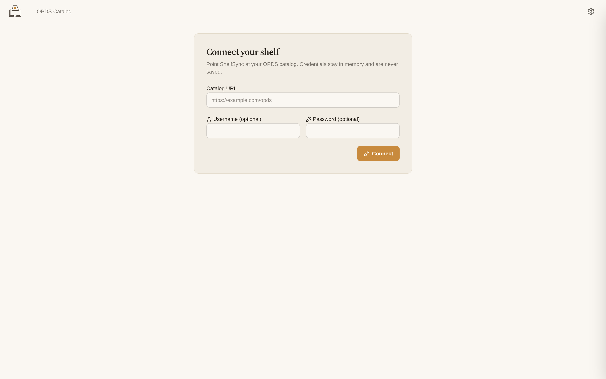
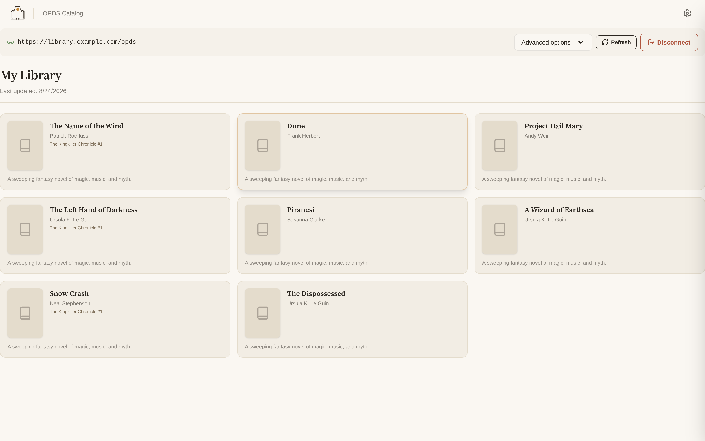
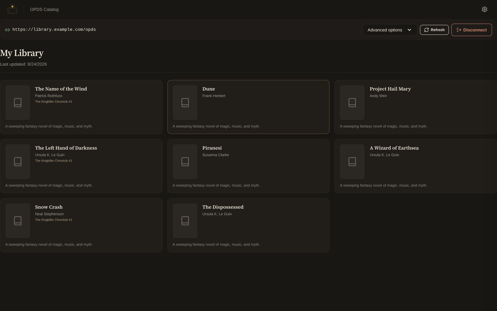

# ShelfSync


[](https://github.com/jdluu/ShelfSync/blob/main/LICENSE)

**ShelfSync** is a cross-platform app for browsing, downloading, and managing
your e-book library from a remote catalog. Connect to an OPDS-compatible
server (such as [Grimmory](https://github.com/jdluu/Grimmory)), download
books with integrity verification, and keep your library available offline
on desktop or Android.

ShelfSync is not an e-reader — it gets verified books onto your device.
Open them with your favorite reading app (we recommend
[Leafline](https://github.com/jdluu/Leafline)).

## Screenshots

**Connect your shelf** — point ShelfSync at any OPDS catalog:



**Browse and download** — cover-forward cards with serif titles, live download
progress, and offline library states:

| Paper (light) | Lamplight (dark) |
|---|---|
|  |  |

## Features

- **OPDS catalog browsing** — navigate, search, and paginate remote catalogs
  with authenticated access (HTTP Basic Auth, scoped to the configured server).
- **Verified downloads** — downloads are staged as `.part` files, hash-checked,
  and renamed atomically so you never end up with corrupt books. Bulk syncs run
  with bounded parallelism and live per-book progress ("X of Y").
- **Offline library management** — every publication tracks its state
  (complete / downloading / failed / unavailable / superseded), with explicit
  reconciliation against the catalog. Your files are never deleted automatically.
- **Secure credentials** — on Android, OPDS account passwords are encrypted
  with a non-exportable key held in the Android Keystore; on desktop they stay
  in memory only.
- **E-Ink friendly UI** — a fast React interface with grouped browsing by
  series, author, tag, or date added; keyboard accessible and screen-reader
  labeled.

## Installation

### Android (Obtainium)

[](https://obtainium.imranr.dev/add/https%3A%2F%2Fgithub.com%2Fjdluu%2FShelfSync)

Tap the badge on your Android device with [Obtainium](https://obtainium.imranr.dev/)
installed, or add the source URL manually: `https://github.com/jdluu/ShelfSync`

### Desktop

Download the latest release for your platform from the
[Releases page](https://github.com/jdluu/ShelfSync/releases):

- **Windows / Linux:** installers under `src-tauri/target/release/bundle`.

No special permissions are required on Android beyond network access;
downloads live in the app's private storage (you can point them at your
Documents folder from the in-app storage picker).

## Building from source

Prerequisites: Rust (stable), Node.js LTS + pnpm, the Tauri prerequisites for
your platform (e.g. libwebkit2gtk on Linux, MSVC Build Tools on Windows), and
optionally the [Infisical CLI](https://infisical.com/docs/cli/overview) plus
the Android NDK for Android builds.

```bash
git clone https://github.com/jdluu/ShelfSync.git
cd ShelfSync
pnpm install
pnpm tauri dev      # run the desktop app in development mode
pnpm tauri build    # production build for your OS
pnpm build:android  # Android build (requires Infisical secrets + NDK)
```

For Android builds, authenticate with Infisical and fetch signing secrets first:

```bash
infisical login
pnpm secrets:fetch
```

## License

[MIT](LICENSE)
