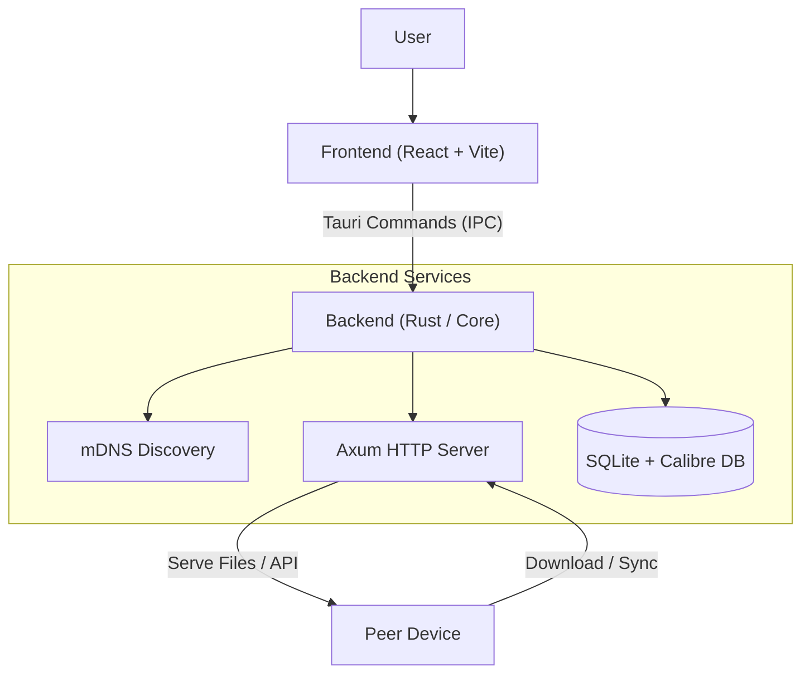

# ShelfSync


ShelfSync is a cross-platform desktop and mobile application designed to facilitate the synchronization of e-book libraries between devices on a local network. Built upon the Tauri framework, it leverages a Rust-based backend for performance and system integration, coupled with a React and TypeScript frontend for a responsive user interface. The application specifically targets Calibre libraries, allowing a central host to serve content to client devices for offline reading.

## System Architecture

The application adheres to a modular architecture that separates concerns between the user interface, domain logic, and infrastructure.



### Backend (Rust)
The backend is constructed using Rust and the Tauri SDK, organized into distinct layers:
*   **Core Layer**: Handles domain logic and Calibre SQLite (`metadata.db`) interactions using **Rusqlite**.
*   **HTTP Layer**: Implements a local REST API using **Axum** and **Tokio**. This layer serves book metadata, covers, and file downloads.
*   **Command Layer**: Serves as the interface between the frontend and backend (IPC).
*   **Infrastructure**: Manages background services, including **mdns-sd** (Multicast DNS) for service discovery.

### Frontend (React + TypeScript)
The frontend is built with React and structured around feature modules:
*   **UI Framework**: Built with **Tailwind CSS**, **DaisyUI**, and **Lucide React** for an accessible and responsive interface featuring skeleton loading sequences.
*   **Features**: Business logic is encapsulated in feature-specific directories (e.g., `host`, `client`, `discovery`).
*   **State Management**: Asynchronous state, caching, and data fetching are managed using **TanStack Query** alongside **Zustand** for local UI state.
*   **Validation**: Strict runtime payload validation across the Tauri IPC boundary using **Zod**.
*   **Storage**: Local configuration is managed using persistent stores (**Tauri Plugin Store**).
*   **Database**: Local client-side book tracking and sync status stored in a local SQLite database.
*   **Testing**: Automated unit testing powered by **Vitest** with centralized Tauri mocked boundaries.

## Features

*   **Dual-Role Operation:** The application can function as either a Host or a Client, configurable at runtime.
*   **Calibre Integration:** Directly parses standard Calibre library databases to retrieve book metadata, authors, series, and file paths.
*   **Automated Discovery:** Utilizes mDNS to automatically detect ShelfSync hosts on the local network.
*   **Grouped Browsing:** Easily navigate large libraries by organizing books by Series, Author, Tag, or Date Added.
*   **Bulk Synchronization:** Supports downloading multiple books or entire collections simultaneously.
*   **Offline Storage:** Maintains a local record of synced content for offline access on client devices.
*   **Secure Device Pairing:** Implements a 4-digit PIN authentication mechanism to prevent unauthorized access.
*   **Disk-based Image Cache:** Server-side resized thumbnails are cached on disk for rapid subsequent loads.

## Prerequisites

To build and run this project, the following dependencies must be installed on the development system:

*   **Rust:** The latest stable version of the Rust programming language and Cargo package manager.
*   **Node.js:** A recent version of Node.js (LTS recommended).
*   **Package Manager:** pnpm is the preferred package manager for this project, though npm or yarn may also be used.
*   **System Dependencies:** Platform-specific development libraries required by Tauri (e.g., `libwebkit2gtk-4.0-dev` on Linux, Visual Studio C++ Build Tools on Windows).

## Installation and Development

1.  Clone the repository to your local machine.
2.  Install frontend dependencies:
    ```bash
    pnpm install
    ```
3.  Start the development server. This command will launch the frontend dev server and compile the Rust backend:
    ```bash
    pnpm tauri dev
    ```

## Building for Production

To create an optimized release build for the current operating system:

```bash
pnpm tauri build
```

The build artifacts will be located in the `src-tauri/target/release/bundle` directory.

## Usage Guide

### Host Mode
1.  Launch the application and select "Host" from the role selection screen.
2.  Click "Select Library" and navigate to the root folder of an existing Calibre library (the folder containing `metadata.db`).
3.  The application will index the library, bind to an available dynamic port (defaulting to 8080), and begin broadcasting its presence on the local network.
4.  A QR code and connection details will be displayed for manual connections if automatic discovery is not available.

### Client Mode
1.  Launch the application and select "Client" from the role selection screen.
2.  The application will automatically scan the network for available ShelfSync hosts.
3.  Click on a discovered host to connect, or use the "Manual Connection" option on the Discovery screen.
4.  Browse the library or Group by Series/Author. Click "Sync" to download books to your **Offline Storage** for reading without an internet connection.